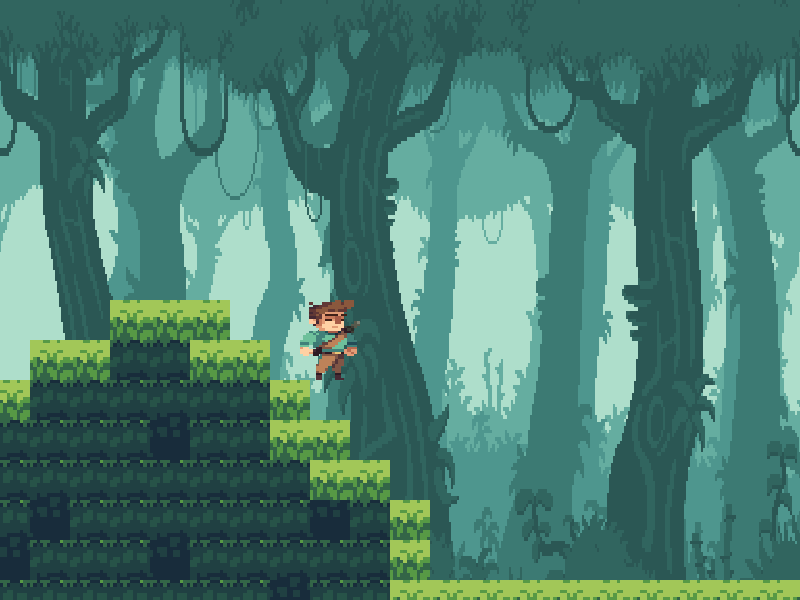

# Man In The Jungle
First game created in c++ with SDL

Status of the game:
- [x] Render engine
- [x] Map generator
- [x] Phisics
- [x] Colision detecton
- [ ] Bots to fight with
- [ ] Make the render engine more configurable

The Project can be run on Linux or Windws.

## Compilation
1. mkdir build && cd build
2. cmake ..
3. make

The screenshots from game:

